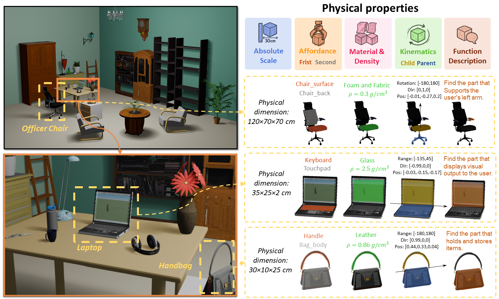

<div align="center">
<h1>PhysX: Physical-Grounded 3D Asset Generation
</h1>

<p align="center"><a href="https://arxiv.org/abs/"></a>
<a href='https://ziangcao0312.github.io/physx_web/'></a>
<a href='https://huggingface.co/datasets/Caoza/PhysX'></a>
<a href='https://youtu.be/M5V_c0Duuy4'></a>
<div>
    <a href="https://ziangcao0312.github.io/" target="_blank">Ziang Cao</a><sup>1</sup>,
    <a href="https://frozenburning.github.io/" target="_blank">Zhaoxi Chen</a><sup>1</sup>,
    <a href="https://github.com/paul007pl" target="_blank">Liang Pan</a><sup>2</sup>,
    <a href="https://liuziwei7.github.io/" target="_blank">Ziwei Liu</a><sup>1</sup>
</div>
<div>
    <sup>1</sup>S-Lab, Nanyang Technological University&emsp; <sup>2</sup>Shanghai AI Laboratory
</div>
<div>


<strong>PhysX provides a new end-to-end paradigm for physical-grounded 3D asset generation.</strong>

<div style="width: 100%; text-align: center; margin:auto;">
    
</div>

:open_book: For more visual results, go checkout our <a href="https://ziangcao0312.github.io/physx_web/" target="_blank">project page</a>
</div>

## PhysXNet & PhysXNet-XL

For more details about our proposed dataset, please see this [link](https://huggingface.co/datasets/Caoza/PhysX)

## PhysGen 

Coming soon

## References

If you find PhysX useful for your work please cite:
```
@article{cao2023large,
  title={Large-Vocabulary 3D Diffusion Model with Transformer},
  author={Cao, Ziang and Hong, Fangzhou and Wu, Tong and Pan, Liang and Liu, Ziwei},
  journal={arXiv preprint arXiv:2309.07920},
  year={2023}
}
```
##### Acknowledgement

The data and code is based on [PartNet]([ShapeNet/PartNet-archive · Datasets at Hugging Face](https://huggingface.co/datasets/ShapeNet/PartNet-archive)) and [TRELLIS](https://github.com/microsoft/TRELLIS). We would like to express our sincere thanks to the contributors.

## :newspaper_roll: License

Distributed under the S-Lab License. See `LICENSE` for more information.

<a href="https://info.flagcounter.com/ukVw"></a>
